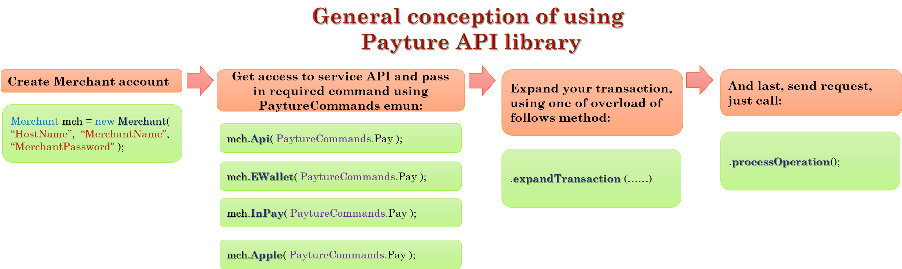

# Java-Payture-official
This is Offical Payture API for Java. We're try to make this as simple as possible for you! Explore tutorial and get started. Please note, you will need a Merchant account,  contact our support to get one. 
Here you can explore how to use our API functions!


## Payture API tutorial
Before fall into the deep, we're need to provide you general conception of working with our API function. See picture: 


## Steps

 * [Creating merchant account](#newMerchant)
 * [Get access to required API](#accessToAPI)
 * [Expand transaction](#expandTransaction)
 * [Send request](#sendRequest)

## [Base Types](#baseTypes)
* [PayInfo](#PayInfo)
* [Card](#Card)
* [Data](#Data)
* [PaytureCommands](#PaytureCommands)
* [Customer](#Customer)
* [PaytureResponse](#PaytureResponse)
* [CardInfo](#CardInfo)
* [Transaction](#Transaction)

## [Test App](#testApp)


Now, let's walk through the steps from the picture above


## First Step - Creating Merchant Account <a id="newMerchant"></a>
To get access for API usage just create the instance of Merchant object, pass in the constructor the name of the host, name of your account and your account password.  Suppose that you have Merchant account with  name: Key = "MyMerchantAccount" and password Password = "MyPassword".

Pass the 'https://sandbox.payture.com' for test as the name of Host (first parameter).
```java
Merchant merchant = new Merchant("https://sandbox.payture.com", "MyMerchantAccount", "MyPassword");
```
We're completed the first step! Go next!
***
Please note, that  Key = "'MyMerchantAccount" and Password = "MyMerchantAccount"  - fake, [our support](http://payture.com/kontakty/) help you to get one!
***

## Second Step - Get access to required API <a id="accessToAPI"></a>
At this step you just call one of following methods on Merchant object (which provide proper API type for you) and pass in the PaytureCommands [see description here](#PaytureCommands): 
* Api (this is PaytureAPI)
```java
merchant.Api( PaytureCommands.Pay );
```
* InPay (this is PaytureInPay)
```java
merchant.InPay( PaytureCommands.Pay );
```
* EWallet (this is PaytureEWallet)
```java
merchant.EWallet( PaytureCommands.Init );
```
* Apple (this is PaytureApplePay)
And pass in the [PaytureCommands](#PaytureCommands).
```java
merchant.Apple( PaytureCommands.Pay );
```
* Android (this is PaytureAndroidPay)
And pass in the [PaytureCommands](#PaytureCommands).
```java
merchant.Android( PaytureCommands.Pay );
```
Result of this methods is the instanse of Transaction object which you expand in the next step. 

 [See this table](#PaytureCommandsTable) for explore what PaytureCommands received  theese methods.

## Third Step - Expand transaction <a id="extpandTransaction"></a>
This is the most difficult step, but you can do it!
In the previous step we get the Transaction object [see here that is it](#Transaction). You need expand it, below you find detailed description how do this for every type of api.

At this step we're call only one method: ExpandTransaction(...). But there are more overload exist!
### expandTransaction ( String orderId, Integer amount )
This overload available in any of the API type

Call this for following PaytureCommands:
* Unblock
* Refund
* Charge
* GetState (PaytureAPI)
* PayStatus (PaytureEWallet, PaytureInPay)

| Parameter's name | Definition                                                        |
| ---------------- | ----------------------------------------------------------------- |
| orderId          | Payment identifier in your service system.                        |
| amount           | Amount of payment kopec. (in case of GetState or PayStatus pass null)                                          |

Example for Charge:

> Note Charge operation we're can make after the funds on Customer's card was blocked.
```java

String orderId = "TESTORD000000000000000000"; //pass in the transaction's OrderId used in PaytureCommands.Block operation.
Integer amount = 7444444; //transaction's Amount used in PaytureCommands.Block

//Create and expand transaction for Api:
Transaction payTransactionApi = merchant.Api( PaytureCommands.Charge ).expandTransaction( orderId, amount );

//Create and expand transaction for InPay:
Transaction payTransactionInPay = merchant.InPay( PaytureCommands.Charge ).expandTransaction( orderId, amount );

//Create and expand transaction for EWallet:
Transaction payTransactionEWallet = merchant.EWallet( PaytureCommands.Charge ).expandTransaction( orderId, amount );
```


### ExpandTransaction Methods for PaytureAPI
#### expandTransaction( PayInfo info, HashMap<String, String> customFields, String customerKey, String paytureId  )
This overload you call for api methods:
* **Pay** (PaytureCommands.Pay).
* **Block** (PaytureCommands.Block).


Description of provided params.

| Parameter's name | Definition                                                                             |
| ---------------- | -------------------------------------------------------------------------------------- |
| info             | Params for transaction processings [see here for explore PayInfo object](#PayInfo)     |
| customerKey      | Customer identifier in Payture AntiFraud system.                                       |
| customFields     | Addition fields for processing (especially for AntiFraud system).                      |
| paytureId        | Payments identifier in Payture AntiFraud system.                                       |

Example for Pay:
```java
PayInfo payInfo = new PayInfo(
    "4111111111111112", // card number, required
     10, //expiration month, required
     20, //expiration year, required
     "Test Test", // cardholder name, required
     123, // secure code, required
     "TestOrder0000000000512154545", // payment's identifier in Merchant system, required
     41000 //amount, required
);
HashMap<String, Object> customFields = new HashMap<String, Object>(); //optional, can be null 
customFields.put( "IP", "93.120.05.36" );
customFields.put( "Description", "SomeUsefullHere" );

String customerKey = "testKey"; // 
String paytureId = ""; //optional 

//Create and expand transaction 
Transaction payTransaction = merchant.Api( PaytureCommands.Pay ).expandTransaction( payInfo, customFields, customerKey, paytureId );
```


### ExpandTransaction Methods for PaytureInPay
#### expandTransaction( Data data )
This overload you call for api **Init** method ( PaytureCommands.Init )
Full description of recieved [data see here](#Data).
You must specify following fields of Data object then call Init api method of PaytureInPay:
* SessionType
* OrderId
* Amount
* IP

Other fields is optional.  Example:
```java
String orderId = "TESTORD000000000000000000";
long amount = 102000; // in kopec
String ip = "93.45.120.14";
Data data = new Data( SessionType.Pay, orderId, amount, ip );

//Create and expand transaction 
Transaction initTransaction = merchant.InPay( PaytureCommands.Init ).expandTransaction( data );
```
> Please note that the response from Init method will be contain SessionId - the unique payment's identifier - further you need to use it in PaytureCommands.Pay  api method for proseccing transaction on Payture side: call manually (suppose, we're have sessionId value from Init):
*  merchant.EWallet( PaytureCommands.Pay ).expandTransaction( sessionId ) - use for SessionType=Pay or SessionType=Block

> To do the same thing you can take value from response's RedirectURL property - which is string representation of Url constracted for you (a value in RedirectURL will be set only in PaytureCommands.Init response, in over cases it has null value)  - and just redirect customer to this address.


### ExpandTransaction Methods for PaytureEWallet
#### expandTransaction( Customer customer, String cardId, Data data ) 
This overload you call for api 
* **Init** (PaytureCommands.Init). 

Example for SessionType=Pay and SessionType=Block:
```java
String cardId = "40252318-de07-4853-b43d-4b67f2cd2077";
Customer customer = new Customer( "testCustomerEW", "testPass" ); 
SessionType sessionType = SessionType.Pay; //= SessionType.Block,  required
String orderId = "TESTORD000000000000000000"; // required
long amount = 102000; // in kopec, required
String ip = "93.45.120.14"; // required
String product = "SomeCoolProduct"; // optional, maybe empty or null
String total = amount; // optional, maybe empty or null
String template = "tempTag"; // optional, maybe empty or null
String lang = "RU"; // optional, maybe empty or null
Data data = new Data ( sessionType, orderId, amount, ip, product, total, template, lang ) // required

//Create and expand transaction 
Transaction initPayTransaction =merchant.EWallet( PaytureCommands.Init ).expandTransaction( customer, cardId, data ); //SessionType=Pay or SessionType=Block
```


Example for SessionType=Add:
```java
String cardId = null; //we're pass null for Add SessionType
Customer customer = new Customer( "testCustomerEW", "testPass" ); 
SessionType sessionType = SessionType.Add; //  required
Stringvar ip = "93.45.120.14"; // required
String template = "tempTag"; // optional, maybe empty or null
String lang = "RU"; // optional, maybe empty or null
Data data = new Data ( sessionType, ip, template, lang ); // required

//Create and expand transaction 
Transaction initAddTransaction = merchant.EWallet( PaytureCommands.Init ).expandTransaction( customer, null, data ); // SessionType=Add
```

> Please note that the response from Init method will be contain SessionId - the unique payment's identifier - further you need to use it in PaytureCommands.Pay or PaytureCommands.Add api methods for proseccing transaction on Payture side: call manually (suppose, we're have sessionId value from Init):
*  merchant.EWallet( PaytureCommands.Pay ).expandTransaction( sessionId ); - use for SessionType=Pay or SessionType=Block
*  merchant.EWallet( PaytureCommands.Add ).expandTransaction( sessionId ); - use for SessionType=Add 

> To do the same thing you can take value from response's RedirectURL property - which is string representation of Url constracted for you (a value in RedirectURL will be set only in PaytureCommands.Init response, in over cases it has null value)  - and just redirect customer to this address.

#### expandTransaction( Customer customer, Data data, String cardId, int secureCode ) 
This overload you call for api 
* **Pay** (PaytureCommands.Pay) - on Merchant side for REGISTERED card

Example for SessionType=Pay and SessionType=Block:
```java
SessionType sessionType = SessionType.Pay; //= SessionType.Block,  required
String orderId = "TESTORD000000000000000000"; // required
String cardId = "40252318-de07-4853-b43d-4b67f2cd2077"; // required
int secureCode = 123; // required
long amount = 102000; // in kopec, required
String ip = "93.45.120.14"; // required
String confirmCode = "SomeCoolProduct"; // optional, maybe empty or null
String[] customFields = new String[5] ; // optional maybe null or contain arbitrary fields of you chose
Customer customer = new Customer( "testCustomerEW", "testPass" ); //required
Data data = new Data ( sessionType, orderId, amount, ip ) // required
data.ConfirmCode = confirmCode;
data.CustomFields = customFields;

//Create and expand transaction 
Transaction payTransaction = merchant.EWallet( PaytureCommands.Pay ).expandTransaction( customer, data, cardId, secureCode);

```
#### expandTransaction( Customer customer, Card card, Data data ) 
This overload you call for api 
* **Pay** (PaytureCommands.Pay) - on Merchant side for NOT REGISTERED card

Example for SessionType=Pay and SessionType=Block:
```java
SessionType sessionType = SessionType.Pay; //= SessionType.Block,  required
String orderId = "TESTORD000000000000000000"; // required
long amount = 102000; // in kopec, required
String ip = "93.45.120.14"; // required
String confirmCode = "SomeCoolProduct"; // optional, maybe empty or null
String customFields = ""; // optional maybe null
Data data = new Data ( sessionType, orderId, amount, ip ) // required
data.ConfirmCode = confirmCode;
data.CustomFields = customFields;

Customer customer = new Customer( "testCustomerEW", "testPass" ); //required

Card card = new Card( 
    "4111111111111112", //card number
    10, //expiration month
    20, //expiration year
    "Card Holder", //CardHolder Name
    111, //secure code
); //required

//Create and expand transaction 
Transaction payTransaction = merchant.EWallet( PaytureCommands.Pay ).expandTransaction( customer, card, data );

```

#### expandTransaction( Customer customer, Card card )
This overload you call for api
* **Add** method ( PaytureCommand.Add ) on Merchant side.

Example:
```java
Customer customer = new Customer( "testCustomerEW", "testPass" ); //required
Card card = new Card( 
    "4111111111111112", //card number
    10, //expiration month
    20, //expiration year
    "Card Holder", //CardHolder Name
    111, //secure code
); //required

//Create and expand transaction 
Transaction addTransaction = merchant.EWallet( PaytureCommands.Add ).expandTransaction( customer, card );
```

Please note, that you can add card *only for registered customer*.


#### expandTransaction( Customer customer )
This overload is called for following api methods:

* **Register** (PaytureCommands.Register),
* **Update** (PaytureCommands.Update), 
* **Delete** (PaytureCommands.Delete), 
* **Check** (PaytureCommands.Check), 
* **GetList** (PaytureCommands.GetList)

Description of recieved [Customer data see here](#Customer).

Example for PaytureCommands.Register:

```java
Customer firstCustomer = new Customer( 
    "testCustomerEW", // login, required
    "testPass", //password, required
     ); 
Customer secondCustomer = new Customer( 
    "testCustomerEW", 
    "testPass", 
    "78456865353", //phone, optional
    "newCustTest@gmailTest@.ru" // email, optional
     );

//Create and expand transaction  
Transaction firstTransaction = merchant.EWallet( PaytureCommands.Reqister ).expandTransaction( firstCustomer );
Transaction secondTransaction = merchant.EWallet( PaytureCommands.Reqister ).expandTransaction( secondCustomer );
```


#### expandTransaction( Customer customer, String cardId, Integer amount, String orderId  ) 
This overload is called for api methods: 
* **SendCode** (PaytureCommands.SendCode). You need to specify all parameters include orderId.
Example:
```java
Customer customer = new Customer( "testCustomerEW", "testPass" ); 
String cardId = "40252318-de07-4853-b43d-4b67f2cd2077";
long amount = 50000; 
String orderId = "TESTORD000000000000000000";

//Create and expand transaction 
Transaction sendCodeTransaction = merchant.EWallet( PaytureCommands.SendCode ).expandTransaction( customer, cardId, amount, orderId );
```
* **Activate** (PaytureCommands.Activate). Specify customer, cardId and amount for this operation.
Example:
```java
Customer customer = new Customer( "testCustomerEW", "testPass" ); 
String cardId = "40252318-de07-4853-b43d-4b67f2cd2077";
long amount = 100; //pass small amount for activate

//Create and expand transaction 
Transaction activateTransaction = merchant.EWallet( PaytureCommands.Activate ).expandTransaction( customer, cardId, amount, null );
```

#### expandTransaction( Customer customer, String cardId )
This overload is called for api method: 
* **Remove** (PaytureCommands.Remove). You need to specify customer and cardId only for this operation. For amount pass null.
Example:
```java
Customer customer = new Customer( "testCustomerEW", "testPass" ); 
String cardId = "40252318-de07-4853-b43d-4b67f2cd2077";

//Create and expand transaction 
Transaction removeTransaction = merchant.EWallet( PaytureCommands.Remove ).expandTransaction( customer, cardId, null, null );
```

#### expandTransaction( String sessionId )
This overload is called for api methods: 
* **Pay** (PaytureCommands.Pay). On Payture side
* **Add** (PaytureCommands.Add). On Payture side

Example for PaytureCommands.Pay:
```java
String sessionId = "e5c43d9f-2646-42bc-aeec-0b9005ceb972"; //received from PaytureCommands.Init 

//Create and expand transaction 
Transaction payTransaction = merchant.EWallet( PaytureCommands.Pay ).expandTransaction( sessionId );
```

#### ExpandTransaction( String MD, String paRes )
This overload is called for api methods: 
* **PaySubmut3DS** (PaytureCommands.PaySubmit3DS).
Example for:
```java
String md = "20150624160356619170 "; //received from ACS 
String pares = "ODJhYTk0NGUtMDk0ZlKJjjhbjlsrglJKJHNFKSRFLLkjnksdfjgdlgkd.... "; //received from ACS 

//Create and expand transaction 
Transaction submitTransaction = merchant.EWallet( PaytureCommands.PaySubmit3DS ).expandTransaction( md, pares );
```


### ExpandTransaction Methods for PaytureApplePay and PaytureAndroidPay
#### expandTransaction(String payToken, String orderId, Integer amount)
This overload you call for api methods:
* **Pay** (PaytureCommands.Pay).
* **Block** (PaytureCommands.Block).

Description of provided params.

| Parameter's name | Definition                                                                             |
| ---------------- | -------------------------------------------------------------------------------------- |
| payToken         | PayToken for current transaction.   |
| orderId          | Current transaction OrderId, if you miss this value (if pass null) - it will be generate on Payture side.    |
| amount           | Current transaction amount in kopec (pass null for ApplePay).                      |


## Last Step - Send request <a id="sendRequest"></a>
After transaction is expanded you can send request to the Payture server via one of two methods:
* processOperation(); - this is sync method. The executed thread will be block while waiting response from the server - return the PaytureResponse object
* ProcessOperationAsync(); - this async method, return Task<PaytureResponse> object;


## Base Types <a id="baseTypes"></a>:


### PayInfo <a id="PayInfo"></a>
This object used for PaytureAPI and consist of following fields:

| Fields's name    | Field's type | Definition                                      |
| ---------------- | ------------ | ----------------------------------------------- |
| OrderId          | String       | Payment identifier in your service system.      |
| Amount           | long         | Amount of payment kopec.                        |
| PAN              | String       | Card's number.                                  |
| EMonth           | Integer      | The expiry month of card.                       |
| EYear            | Integer      | The expiry year of card.                        |
| CardHolder       | String       | Card's holder name.                             |
| SecureCode       | Integer      | CVC2/CVV2.                                      |

Example of creation instence of PayInfo, only one constructor is available:
```java
PayInfo info = new PayInfo( "4111111111111112", 10, 20, "Test Test", 123, "TestOrder0000000000512154545", 580000  );
```

### Card <a id="Card"></a>
This object used for PaytureEWallet and consist of following fields:

| Fields's name    | Field's type | Definition                                      |
| ---------------- | ------------ | ----------------------------------------------- |
| CardId           | String       | Card identifier in Payture system.              |
| CardNumber       | String       | Card's number.                                  |
| EMonth           | Integer      | The expiry month of card.                       |
| EYear            | Integer      | The expiry year of card.                        |
| CardHolder       | String       | Card's holder name.                             |
| SecureCode       | Integer      | CVC2/CVV2.                                      |

Examples of creation instance of Card:
```java
Card card = new Card( "4111111111111112", 10, 20, "Test Test", 123 ); //create card with CardId = null
Card cardWithId = new Card( "4111111111111112", 10, 20, "Test Test", 123, "40252318-de07-4853-b43d-4b67f2cd2077" ); //create card with CardId = "40252318-de07-4853-b43d-4b67f2cd2077"
```
### Data <a id="Data"></a>
This is object used for PaytureEWallet and PaytureInPay, consist of following fields 

| Fields's name    | Field's type  | Definition                                                                                                          |
| ---------------- | ------------- | ------------------------------------------------------------------------------------------------------------------- |
| SessionType      | String        | Session Type - determines the type of operation. In this object - it's string representation of SessionType enum.   |
| IP               | String        | Customer's IP adress.                                                                                               |
| TemplateTag      | String        | Tamplate which used for payment page.                                                                               | 
| Language         | String        | Addition parameter for determining language of template.                                                            |
| OrderId          | String        | Payment identifier in your service system.                                                                          |
| Amount           | long          | Amount of payment kopec.                                                                                            |
| Url              | String        | The adress to which Customer will be return after completion of payment.                                            |
| Product          | String        | Name of product.                                                                                                    | 
| Total            | Integer       | Total Amount of purchase.                                                                                           |
| ConfirmCode      | String        | Confirmation code from SMS. Required in case of confirm request for current transaction.                            |
| CustomFields     | String        | Addition transaction's fields.                                                                                      |


### PaytureCommands <a id="PaytureCommands"></a>
This is enum of **all** available commands for Payture API.

PaytureCommands list and availability in every api type

| Command      | Api | InPay | EWallet | Apple | Android | Description                                                                                                            |
| ------------ | --- | ----- | ------- | ----- | ------- | ---------------------------------------------------------------------------------------------------------------------- |
| Pay          |  +  |   +   |    +    |   +   |    +    | Command for pay transaction. In InPay and EWallet can be used for Block operation                                      |
| Block        |  +  |       |         |   +   |    +    | Block of funds on customer card. You can write-off of funds by Charge command or unlocking of funds by Unblock command |
| Charge       |  +  |   +   |    +    |       |         | Write-off of funds from customer card                                                                                  |
| Refund       |  +  |   +   |    +    |       |         | Operation for refunds                                                                                                  |
| Unblock      |  +  |   +   |    +    |       |         | Unlocking of funds  on customer card                                                                                   |
| GetState     |  +  |       |         |       |         | Get the actual state of payments in Payture processing system                                                          |
| Init         |     |   +   |    +    |       |         | Payment initialization, customer will be redirected on Payture payment gateway page for enter card's information       |
| PayStatus    |     |   +   |    +    |       |         | Get the actual state of payments in Payture processing system                                                          |
| Add          |     |       |    +    |       |         | Register new card in Payture system                                                                                    |
| Register     |     |       |    +    |       |         | Register new customer account                                                                                          |
| Update       |     |       |    +    |       |         | Update customer account                                                                                                |
| Check        |     |       |    +    |       |         | Check for existing customer account in Payture system                                                                  |
| Delete       |     |       |    +    |       |         | Delete customer account from Payture system                                                                            |
| Activate     |     |       |    +    |       |         | Activate registered card in Payture system                                                                             |
| Remove       |     |       |    +    |       |         | Delete card from Payture system                                                                                        |
| GetList      |     |       |    +    |       |         | Return list of registered cards for the customer existed in Payture system                                             |
| SendCode     |     |       |    +    |       |         | Additional authentication for customer payment                                                                         |
| Pay3DS       |  +  |       |         |       |         | Command for one-stage charge from card with 3-D Secure                                                                 |
| Block3DS     |  +  |       |         |       |         | Block of funds on customer card with 3-D Secure                                                                        |
| PaySubmit3DS |     |       |    +    |       |         | Commands for completed charging funds from card with 3-D Secure                                                        |


### Customer <a id="Customer"></a>
This object used for PaytureEWallet and consist of following fields:

| Fields's name    | Field's type | Definition                                                       |
| ---------------- | ------------ | ---------------------------------------------------------------- |
| VWUserLgn        | String       | Customer's identifier in Payture system. (Email is recommended). |
| VWUserPsw        | String       | Customer's password in Payture system.                           |
| PhoneNumber      | String       | Customer's phone number.                                         |
| Email            | String       | Customer's email.                                                |

```java
Customer customer = new Customer( "testLogin@mail.com", "customerPassword", null, null ); //create customer without phone and email
Customer customer2 = new Customer( "testLogin@mail.com", "customerPassword", "77125141212", "testLogin@mail.com" ); //customer with all fields
```


### PaytureResponse <a id="PaytureResponse"></a>
This object is response from the Payture server and consist of following fields:

| Fields's name    | Field's type                | Definition                                                                                       |
| ---------------- | --------------------------- | ------------------------------------------------------------------------------------------------ |
| APIName          | PaytureCommands             | Name of commands that was called.                                                                |
| Success          | Boolean                     | Determines the success of processing request.                                                    |
| ErrCode          | String                      | Will be contain code of error if one occur during process the transaction on the Payture server. | 
| RedirectURL      | String                      | Will be contain the new location for redirect. (for PaytureCommands.Init).                       |
| Attributes       | HashMap<String, String>     | Addition attributes from the response.                                                           |
| RedirectURL      | String                      | Will be contain the new location for redirect. (for PaytureCommands.Init).                       |
| ListCards        | List<CardInfo>              | List of cards, theese registered for current Customer (this field filled for PaytureCommands.GetList)  |
| ResponseBodyXML  | String                      | String representation received from Payture server in XML format                                 |


### CardInfo <a id="CardInfo"></a>
Special object for containing Customer card's information, that we're received from PaytureCommands.GetList command

| Fields's name    | Field's type  | Definition                                                             |
| ---------------- | ------------- | ---------------------------------------------------------------------- |
| CardNumber       | String        | The masked card's number.                                              |
| CardId           | String        | Card identifier in Payture system.                                     |
| CardHolder       | String        | Name of card's holder                                                  | 
| ActiveStatus     | String        | Indicate of card's active status in Payture system                     |
| Expired          | Boolean       | Indicate whether the card expired on the current date                  |
| NoCVV            | Boolean       | Indicate whether or not payment without CVV/CVC2                       |

### Transaction <a id="Transaction"></a>
You don't needed to create object of this type by yoursef - it will be created for you then you access to appopriate API via Merchant object. 
This object contans the necessary fields which used in request construction process. And this is abstract type.


## Test application <a id="testApp"></a>
You can download simple test application - realized as console app - and test work of our API just type the command in command line. Full description of command for app available into app by the command help. And then the app starts - it ask you for necessity of assistance.


Visit our [site](http://payture.com/) for more information.
You can find our contact [here](http://payture.com/kontakty/).